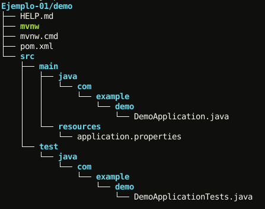

## Ejemplo Spring Initializr

### OBJETIVO

- Crear un proyecto de Spring Boot usando Spring Initializr

#### REQUISITOS

1. Tener un IDE instalado, de preferencia IntelliJ IDEA.

#### DESARROLLO

Visitar [Spring Initializr](https://start.spring.io/) y explorar las opciones que nos ofrece, por ahora usaremos las opciones por defecto.

Cuando terminemos de explorar podemos presionar el boton `generate` para descargar el proyecto de Spring boot.

Una vez descargado el archivo lo podemos descomprimir y tendremos la siguiente estructura de archivos:

Y podemos abrir el proyecto en IntelliJ IDEA con la opción `open`. Una vez abierto esperamos a que el IDE baje las dependencias (puede tardar mucho dependiendo de la conexión de internet). Cuando termine de bajar podemos correr el proyecto por medio del menu `Run > Run 'DemoApplication'` (O con `Shift-F10`).

