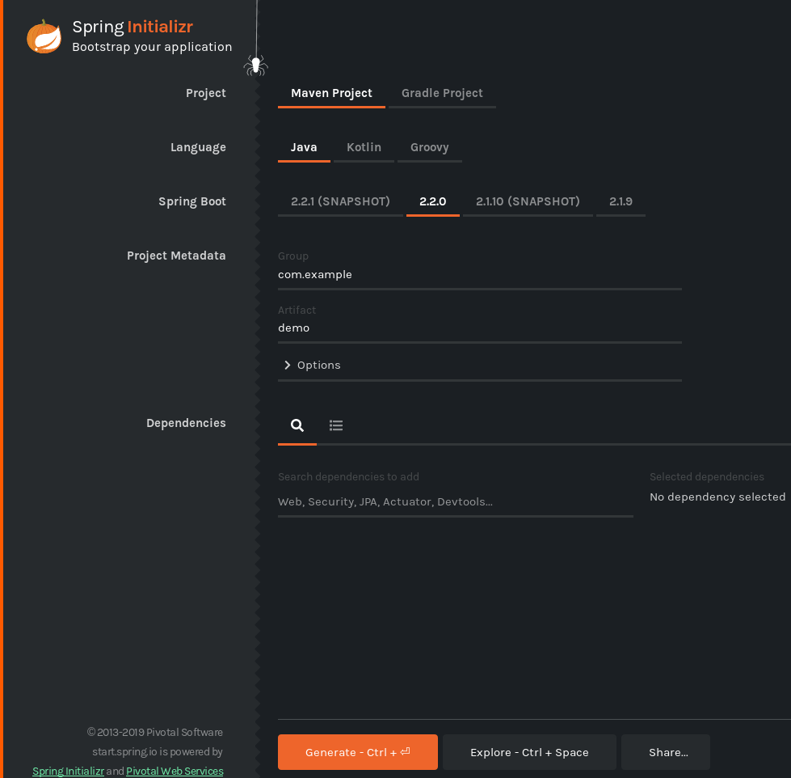
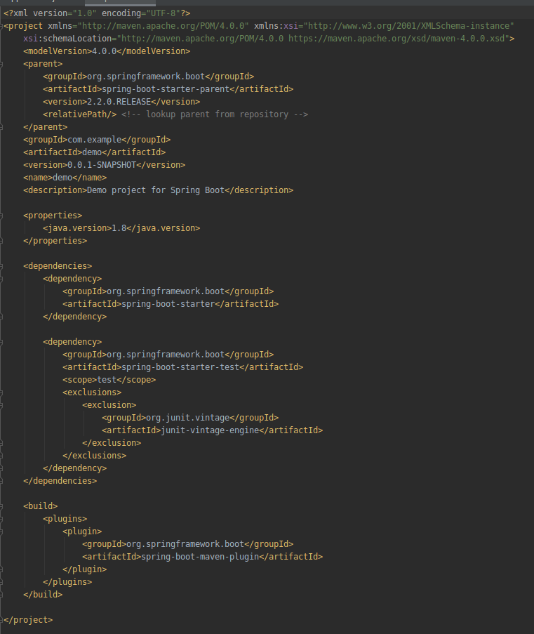

## Spring Boot y Maven

### OBJETIVO

- Crear un proyecto de Spring Boot usando Maven como manejador de dependencias.

#### REQUISITOS

1. Tener IntelliJ IDEA instalado.

#### DESARROLLO

Visitar [Spring Initializr](https://start.spring.io/) y seleccionar las mismas opciones que se muestran en la siguiente figura.

Una vez descargado el proyecto podemos descomprimirlo y abrirlo en IntelliJ IDEA. Un archivo importante a notar es el archivo `pom.xml` el cual maneja la configuración de Maven. En este archivo se manejan las dependencias que usará nuestro proyecto así como la versión de java que usaremos.

