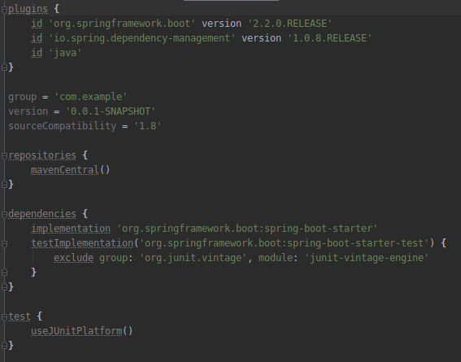

## Spring Boot y Gradle

### OBJETIVO

- Hacer un proyecto de Spring Boot usando Gradle como manejador de dependencias.

#### REQUISITOS

1. Tener IntelliJ IDEA instalado y funcionando.

#### DESARROLLO

Visitar [Spring Initializr](https://start.spring.io/) y seleccionar las mismas opciones que se muestran en la siguiente figura.

Una vez descargado el proyecto podemos descomprimirlo y abrirlo en IntelliJ IDEA. Un archivo importante a notar es el archivo [build.gradle](demo/build.gradle) el cual maneja la configuración de Gradle. En este archivo se manejan las dependencias que usará nuestro proyecto así como la versión de java que usaremos. El archivo [settings.gradle](demo/settings.gradle) tambien es importante y maneja los sub-proyectos de nuestro proyecto pero el IDE se encarga de actualizarlo en la mayoria de los casos de uso normales.

