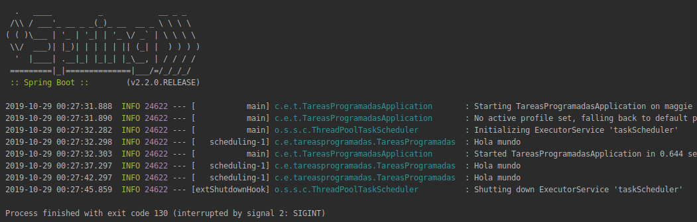

## Tareas programadas con Spring

### OBJETIVO

Hacer que tareas se ejecuten cada cierto tiempo usando Spring.

#### REQUISITOS

Tener instalado y configurado IntelliJ Idea y crear un proyecto con Spring Initializr usando `gradle`. De ahora en adelante usaremos gradle como manejador de dependencias.

#### DESARROLLO

Una vez creado un proyecto con Spring Initializr vamos a empezar a explorar las facilidades que nos ofrece Spring y Spring Boot para desarrollar aplicaciones de backend. Empezaremos con algo sencillo: hacer que Spring ejecute una tarea cada cierto tiempo.

Agregaremos una dependencia para hacer logging `slf4j-api`, para esto hay que referirnos a los retos anteriores o a [build.gradle](tareas-programadas/build.gradle) (linea 17)

Empecemos creando una nueva clase en `src/main/java/com.example.tareasprogramadas` llamada [TareasProgramadas.java](tareas-programadas/src/main/java/com/example/tareasprogramadas/TareasProgramadas.java)

Por ultimo agregaremos una notación a nuestra aplicación para activar la planificación de tareas. [TareasProgramadasApplicacion.java](tareas-programadas/src/main/java/com/example/tareasprogramadas/TareasProgramadasApplication.java)

