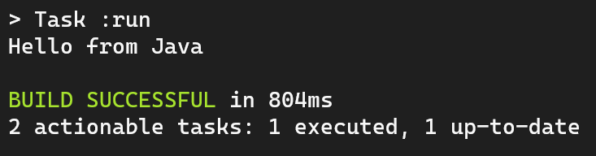

`Desarrollo Web` > `BackEnd Básico Java`

## 🧠 Ejemplo 04: Compilando y Ejecutando aplicaciones Java

### 🎯 OBJETIVO

- Compilar y ejecutar una aplicación de Java a través de Gradle

### 📃 REQUISITOS

1. Tener **Gradle** instalado en el equipo
2. Tener un editor de código instalado en el equipo
3. Tener acceso a la terminal del equipo

### 🎩 DESARROLLO

En el ejercicio anterior logramos poder ejecutar el JAR que genera el plugin de Java para Gradle pero a pesar de eso el proceso para correr un programa sigue siendo bastante complicado... ¿existirá alguna forma de hacerlo más simple? 😫

Afortunadamente existe un plugin de Gradle llamado **application** que permite no solo la compilación de código Java, si no también su ejecución, así que manos a la obra ⚒

Comenzamos creando nuevamente un archivo `build.gradle` pero en esta ocasión utilizaremos el plugin de *application*:

```groovy
plugins {
  id 'application'
}
```

Después, al igual que con el plugin de Java hay que especificar cuál será la clase principal de nuestra aplicación:

```groovy
//...

application {
  mainClass = "HelloWorldExample"
}
```

Por lo tanto al ejecutar el comando `gradle tasks` podremos ver las tareas disponibles:


Finalmente ejecutaremos el comando `gradle run` y veremos el resultado de ejecutar nuestro programa en la terminal:

