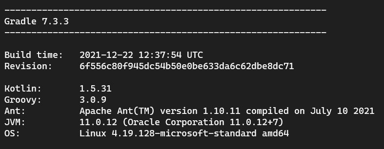

`Desarrollo Web` > `BackEnd Básico Java`

## 👋 Sesión 1: Construcción de proyectos con Gradle

### 🎯 Objetivo de la sesión

- Aprender el uso de la herramienta Gradle para construir y ejecutar proyectos en lenguaje Java.

### ⚙ Configuración

- Gradle
- Editor de código

### 🎯 Qué aprenderán

- Creación de archivo `build.gradle`
- Compilación de código Java usando Gradle
- Ejecución de programas en código Java usando Gradle
- Instalación y uso de plugins de Gradle

### 👀 Antes de comenzar...

Debemos verificar que nuestro equipo tenga correctamente instalado **Java** y **Gradle**:

- Para verificar la versión instalada de **Java** ejecuta el comando `java -version`:

*Nota: Usaremos la versión 11 de Java aunque puedes usar la más reciente.*

- Para verificar la versión instalada de **Gradle** ejecuta el comando `gradle -version`:

*Nota: Usaremos la versión 7 de Gradle aunque puedes usar la más reciente.*

### 🎩 Introducción

Todo proyecto que utilice Gradle como herramienta de construcción debe tener un archivo llamado `gradle.build` el cual contiene las instrucciones necesarias (en lenguaje Groovy) para ejecutar **tareas** que ayuden a realizar alguna acción sobre código.

Comenzaremos creando nuestras propias tareas personalizadas para conocer el uso básico de Gradle y posteriormente crearemos nuestras primeras aplicaciones Java siendo compiladas y ejecutadas por el mismo Gradle.

### 📚 Organización de la Clase

- Tareas personalizadas

	- [Ejemplo 01](Ejemplo-01)

- Compilación y generación de archivos JAR

	- [Ejemplo 02](Ejemplo-02)
  - [Ejemplo 03](Ejemplo-03)
  - [Reto 01](Reto-01)

- Compilación y ejecución de aplicaciones Java

	- [Ejemplo 04](Ejemplo-04)
	- [Reto 02](Reto-03)

- **POSTWORK**
 
  - [Compilación de Markdown](Postwork)