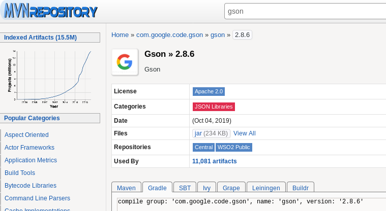
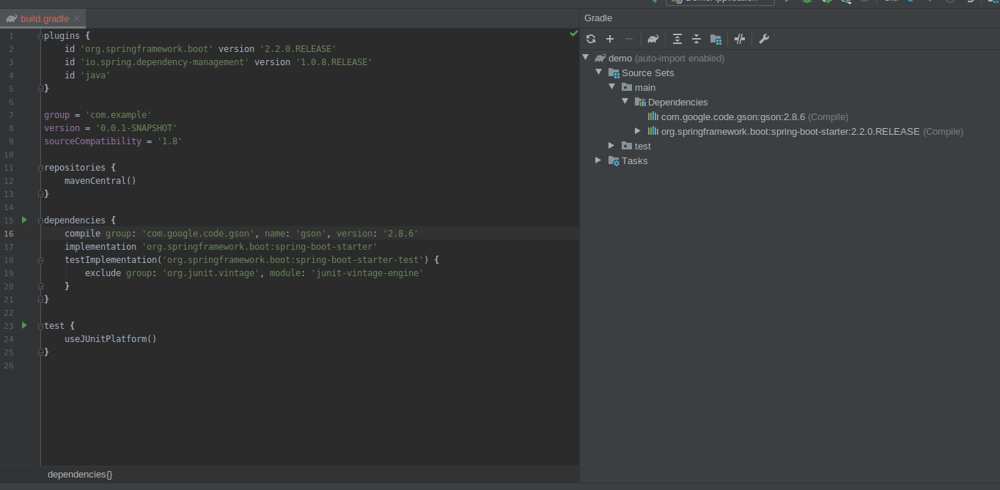

## Ejemplo de dependencias con repositorios

### OBJETIVO

- Conocer que es un repositorio de dependencias y como usarlo.

#### REQUISITOS

Un proyecto de Spring Boot y Gradle como los que se crearon en la sesión 1.

#### DESARROLLO

Visitar [Maven Repository](https://mvnrepository.com/) y buscar `gson` la cual es una libreria para manejar JSON. Despues de seleccionar alguna version en específico llegamos a algo similar a la siguiente imagen.

Como en los ejemplos usaremos Gradle seleccionamos la pestaña de Gradle y copiamos la linea y la pegamos en el `build.gradle` en la parte de `dependencies` despues de un momento IntelliJ IDEA habrá descargado la dependencia y podremos usarla en un futuro en nuestro proyecto.

