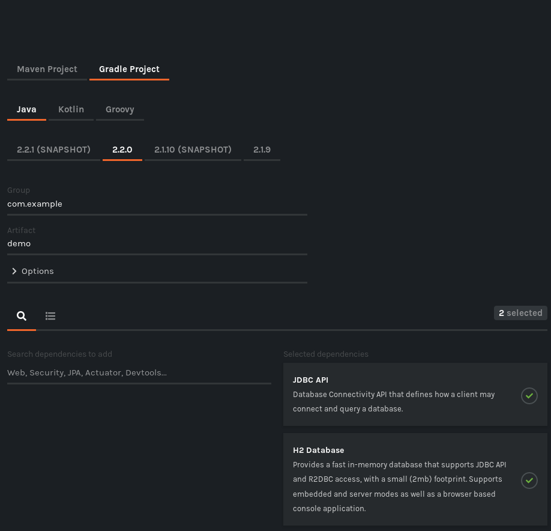
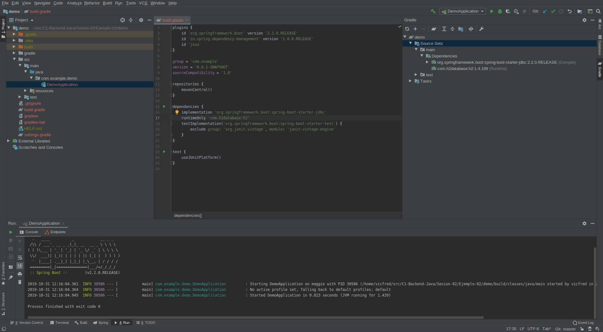

## Ejemplo JDBC Starter

### OBJETIVO

- Conocer los starters de Spring Boot, en particular el starter de JDBC que nos ayudara en proximas sesiones para manejar bases de datos relacionales.

#### REQUISITOS

Un proyecto de Spring Boot como los que se crearon en la sesión 1.

#### DESARROLLO

Visitar [Spring Initializr](https://start.spring.io/) y crear un proyecto agregando las dependencias `JDBC API` y `H2 Database` ya sea por medio de la busqueda o seleccionandolas en la lista.

Descargamos el proyecto y lo abrimos en IntelliJ IDEA.

