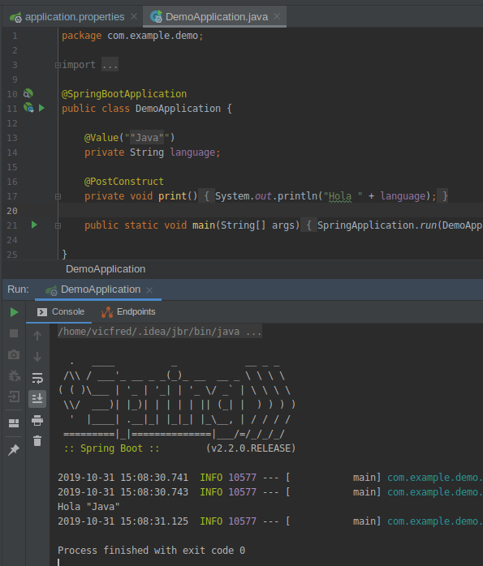

## Propiedades de configuración

### OBJETIVO

- Usar propiedades de configuración con Spring Boot.

#### REQUISITOS

Un proyecto de Spring Boot y Gradle como los que se crearon en la sesión 1.

#### DESARROLLO

Despues de hacer un proyecto de Spring Boot con gradle en Spring Initializr lo abrimos en IntelliJ IDEA. El archivo que nos interesa para este ejemplo es `src/main/java/resources/application.properties` en el cual vamos a guardar configuración de nuestros servicios como puertos y urls de bases de datos.

Esta configuración la usará Spring Boot de manera automatica o la podemos usar nosotros mismos en nuestras aplicaciones, se usa para datos que pueden cambiar de usuario a usuario.

