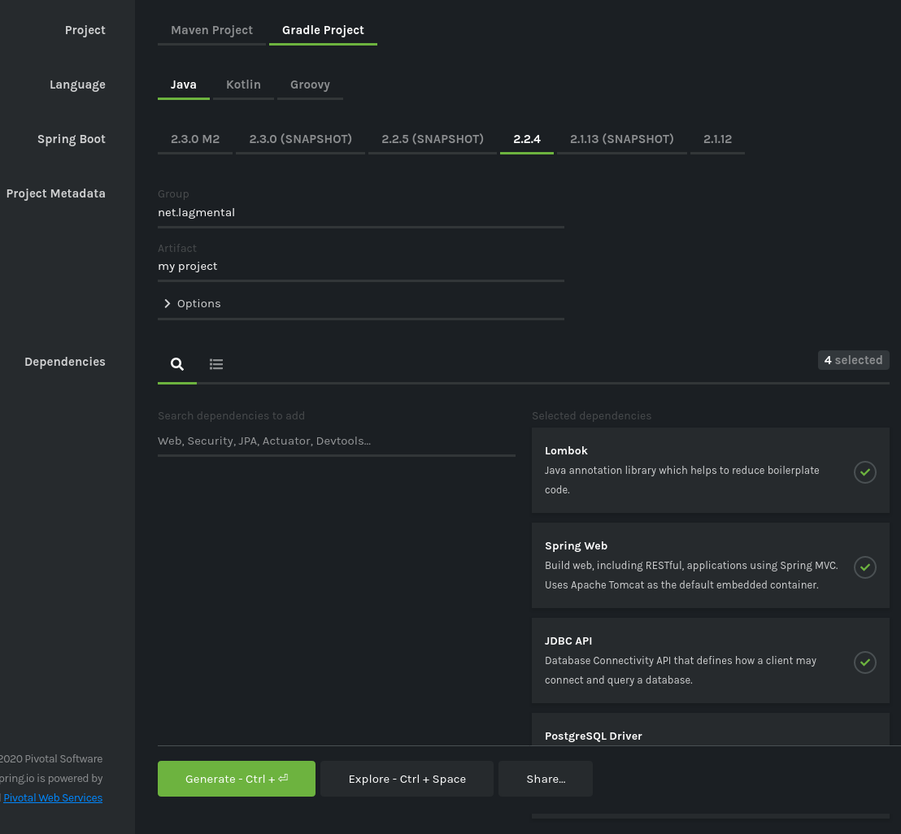
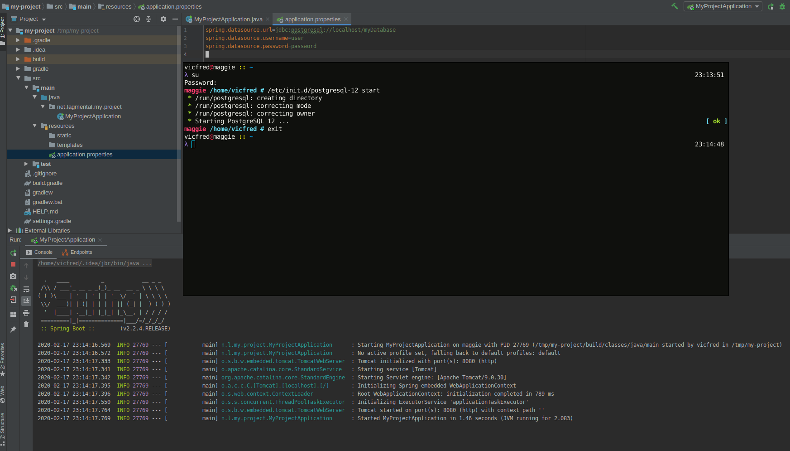

## Postwork Sesión 02

### OBJETIVO

Agregar starters de spring boot y dependencias necesarias para tu proyecto desde algún repositorio como el de maven.

Por ejemplo podemos agregar dependencias para un sitio web que use una base de datos: Spring Web, JDBC API, Lombok y PostgreSQL

#### Instrucciones

Entrar al sitio web de spring initializr y seleccionar las dependencias adecuadas que se ajusten a nuestro proyecto personal. En caso de usar un sistema de bases de datos podemos hacer que nuestro proyecto de spring de java se conecte a esté por medio del application.properties como se mostró en esta sección.

Una vez seleccionadas las dependencias y opciones de nuestro proyecto podemos descargar un archivo comprimido y despues de descomprimirlo abrirlo en IntelliJ IDEA.

