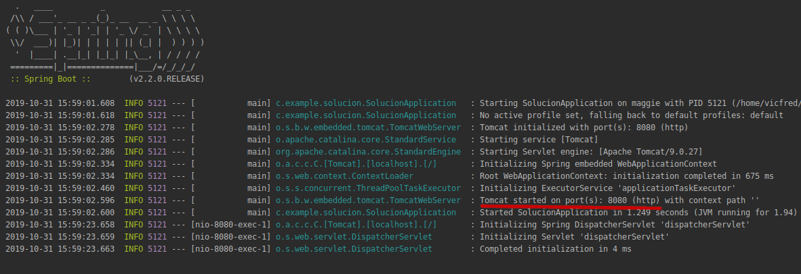

## Reto Web Starter 

### OBJETIVO 

Agregar web starter como dependencia a nuestro proyecto con Spring Initializr.

#### REQUISITOS 

IntelliJ IDEA funcionando.

#### DESARROLLO

Visitar [Spring Initializr](https://start.spring.io/), seleccionar las opciones adecuadas, descargar el proyecto e importarlo a IntelliJ IDEA.

#### Solución

Consultar la carpeta [solucion](solucion)

Notemos que al correr la aplicación de Spring Boot levantará un servidor Tomcat por nosotros en el puerto 8080 el cual usaremos en proximas sesiones.

