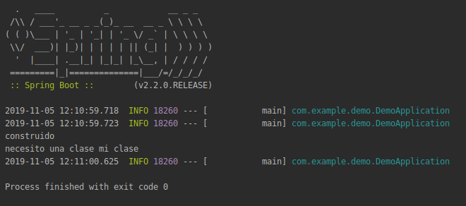

## Inyección de dependencias

### OBJETIVO

Entender la inyección de dependencias a traves de un ejemplo.

#### REQUISITOS

Un proyecto básico de spring boot como los que se hicieron en sesiones pasadas.

#### DESARROLLO

Con este ejemplo vamos a hacer uso de la inyección de dependencias y del contenedor de spring.

Empezamos por definir una interface [MiInterface.java](demo/src/main/java/com/example/demo/MiInterface.java) y haciendo una implementación de esta interface [MiClase.java](demo/src/main/java/com/example/demo/MiClase.java) así como una factory [MiFactory.java](demo/src/main/java/com/example/demo/MiFactory.java) para esta clase, el uso de factories en java es muy común y son clases que sirven para construir instancias de otra clase, en este caso de clase `MiClase`.

Con esto podemos decirle a nuestra aplicación que registre un `Bean` del tipo `MiInterface` y cada vez que necesitemos una clase de tipo `MiInterface` podemos usar Spring para que nos provea de una instancia de este tipo como podemos ver en [NecesitoUnaClase.java](demo/src/main/java/com/example/demo/NecesitoUnaClase.java)

