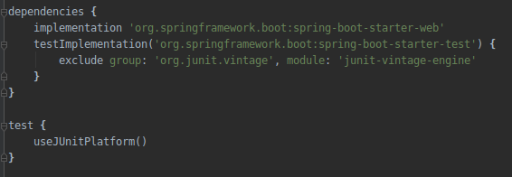
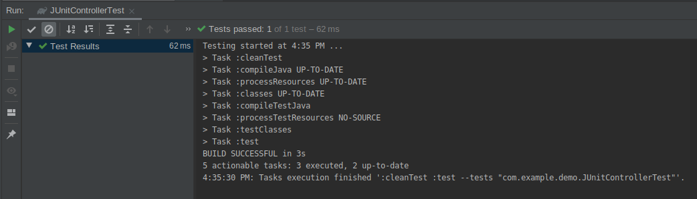

## Pruebas en spring boot

### OBJETIVO

Hacer una prueba básica usando junit con spring boot.

#### REQUISITOS

Un proyecto de spring boot creado con spring initializr con la dependencia de Spring Web.

#### DESARROLLO

Despues de descargar el proyecto de spring boot creado con initializr notemos que por defecto ya incluye una dependencia del starter de spring boot para test.

También notemos que por defecto tenemos una clase para pruebas en `demo/src/test/java/com/example/demo/DemoApplicationTests.java` pero vamos a crear nuestra propia clase en la misma ruta pero con el nombre `ControladorTests.java`.

Creamos una clase que vamos a probar [Controlador.java](demo/src/main/java/com/example/demo/Controlador.java) y vamos a usar la anotación `@Test` para decirle a JUnit que nuestra función es un test como vemos en [ControladorTests.java](demo/src/test/java/com/example/demo/ControladorTests.java) una vez hecha la prueba podemos correrla con el IDE usando `Shift-F10`.

