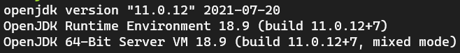
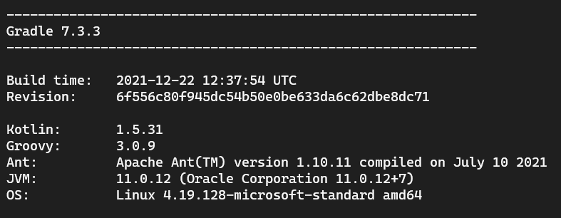

`Desarrollo Web` > `BackEnd Básico Java`

## 👋 Sesión 3: Anotaciones y Pruebas Unitarias con JUnit

### 🎯 Objetivo de la sesión

- Identificar qué son las anotaciones en Java
- Distinguir los distintos usos de las anotaciones
- Identificar qué es JUnit
- Distinguir la importancia de las pruebas unitarias

### ⚙ Configuración

- Gradle
- Editor de código

### 🎯 Qué aprenderán

- Aprender qué es una prueba unitaria y los beneficios de estas durante el ciclo de vida del desarrollo de software.
- Aplicar pruebas unitarias usando JUnit 5 para validar el correcto funcionamiento de una aplicación de forma automática.

### 👀 Antes de comenzar...

Debemos verificar que nuestro equipo tenga correctamente instalado **Java** y **Gradle**:

- Para verificar la versión instalada de **Java** ejecuta el comando `java -version`:

*Nota: Usaremos la versión 11 de Java aunque puedes usar la más reciente.*

- Para verificar la versión instalada de **Gradle** ejecuta el comando `gradle -version`:

*Nota: Usaremos la versión 7 de Gradle aunque puedes usar la más reciente.*

### 🎩 Introducción

Una prueba tiene como objetivo evaluar la funcionalidad de una aplicación e identificar posibles errores. Dentro del mundo de las pruebas, el tipo más básico son las **pruebas unitarias**, las cuales se encargan de validar una funcionalidad única de una parte de nuestro código. 

En Java existen varios frameworks para realizar pruebas unitarias. El más ampliamente utilizado es JUnit. 

### 📚 Organización de la Clase

- Pruebas unitarias con JUnit

	- [Ejemplo 01](Ejemplo-01)
	- [Reto 01](Reto-01)

- Pruebas unitarias con JUnit y Mockito

	- [Ejemplo 02](Ejemplo-02)
	- [Reto 02](Reto-02)

- Suites de pruebas

	- [Ejemplo 03](Ejemplo-03)
	- [Reto 03](Reto-03)
  

- **POSTWORK**
 
  - [Pruebas Dinámicas](Postwork)