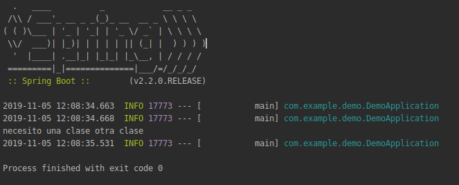

## Inyección de dependencias

### OBJETIVO 

Hacer una clase y registrarla en el contenedor de Spring.

#### REQUISITOS 

Comprender el ejemplo 1

#### DESARROLLO

Hacer una clase nueva que implemente la interface `MiInterface.java` y hacer que el bean que registramos en nuestra aplicación `DemoApplication.java` regrese una clase de este tipo.

#### Solución
Ver el proyecto [solucion](solucion)

