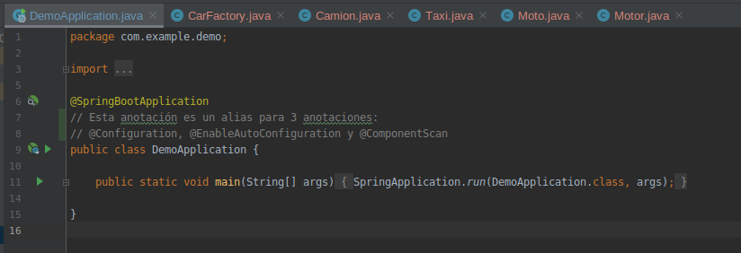

## Anotaciones de Spring

### OBJETIVO

- Aprender las anotaciones mas utilizadas de spring

#### REQUISITOS

1. Un proyecto de spring boot creado con spring initializr
2. Conocer el concepto de anotaciones en Java

#### DESARROLLO

Creamos 3 clases `Camion`, `Moto` y `Taxi` las cuales necesitan una clase `Motor`. En cada una usamos un metodo distinto de inyección de dependencias y usamos la anotación `@Autowired` para decirle al contenedor de Spring que la provea.

Usamos una clase de configuración que lo unico que hará es registrar beans en el contenedor de Spring `CarFactory` y le decimos a Spring sobre ella con la anotación `@Configuration`. Para registrar un bean en el contenedor de spring usamos la anotación `@Bean`.

