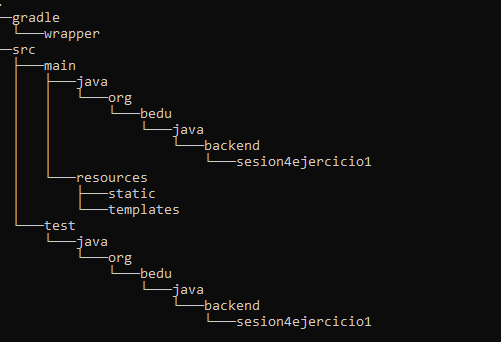
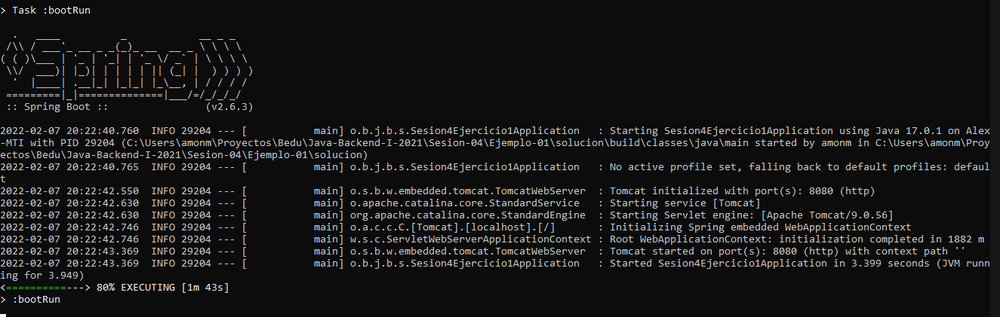

`Desarrollo Web` > `BackEnd Básico Java`

## 🧠 Ejemplo 01: Proyecto Gradle con Spring Initializr

### 🎯 OBJETIVO

- Crear un proyecto Gradle usando Spring Initializr.
- Compilar, empaquetar y ejecutar la aplicación o proyecto generados desde la línea de comandos.

### 📃 REQUISITOS

1. Tener **Gradle** instalado en el equipo
1. Tener instalado el JDK versión 11 o superior.

### 🎩 DESARROLLO

Spring Initializr es un portal que se encarga de generar, de forma automática, los archivos necesarios para iniciar un proyecto Spring Boot. A través de este portal puedes seleccionar diferentes opciones como la versión de Java con la que desarrollarás tu proyecto, la herramienta de gestión del proyecto (Maven o Gradle), y los módulos o librerias que usarás.

Su objetivo es ayudarnos a generar esa estructura inicial del proyecto de una forma fácil y rápida para que podamos comenzar el desarrollo en el menor tiempo posible, teniendo la confianza de que contamos con una estructura correcta.

#### Implementación

Entra al sitio de [Spring Initializr](https://start.spring.io/). Ahí verás una sola página dividida en dos secciones. Comienza llenando la información de la sección del lado izquierdo. Selecciona:
  - Gradle Proyect (no te preocupes, no es necesario que tengas Gradle instalado).
  - Lenguaje: **Java**.
  - Versión de Spring Boot, la versión estable más reciente
  - Grupo, artefacto y nombre del proyecto.
  - Forma de empaquetar la aplicación: **jar**.
  - Versión de Java: **11** o **17**.

En la sección de la derecha (las dependencias) presiona el botón `Add dependencies` y en la ventana que se abre busca la dependencia `Web` o `Spring Web`.

Selecciona la dependencia `Spring Web` y con eso debes verla en la lista de las dependencias del proyecto:

Presiona el botón "GENERATE" (o presiona `Ctrl` + `Enter` en tu teclado) para que comience la descarga del proyecto.

Descomprime el archivo `zip` descargado, el cual tiene más o menos el siguiente contenido.

Abre una terminal o línea de comandos en el directorio que acabas de descomprimir y ejecuta los siguientes comandos, los cuales se ejecutan en Gradle gracias a un *wrapper* que se distribuye dentro del paquete que acabas de descargar:

        gradlew clean build
      
7. La salida del comando anterior debe ser parecida a la siguiente:

Una vez que todo está compilado, usa el siguiente comando para ejecutar la aplicación. 

        gradlew bootRun
        
Debes obtener una salida similar a la siguiente:

Esto indica que la aplicación se está ejecutando en el puerto **8080**. Como no hemos colocado ningún contenido en la aplicación no hay mucho que mostrar pero podremos comprobar que la aplicación está bien configurada, que todos los elementos necesarios están instalados y configurados y que nuestra aplicación se ejecuta de forma correcta:

      http://localhost:8080
      
Una vez que el sitio cargue, debes ver una pantalla como la siguiente:

Detén la aplicación presionando `Ctrl + C` en la terminal en donde levantaste la aplicación.

Puesto que la aplicación está completamente contenida en un archivo `jar`, también es posible ejecutarla de otra forma.

Al compilar la aplicación con `gradlew build` se creó un directorio `build` y dentro de este un directorio `libs`. Navega a este directorio, el cual debe contener solamente un archivo `jar`.

Abre una terminal en este directorio y ejecuta el siguiente comando (cambia el nombre del jar si en tu caso es diferente):

        java -jar sesion4-ejercicio1-0.0.1-SNAPSHOT.jar
        
Con esto debes obtener una salida como la siguiente:

Nuevamente, esto indica que la aplicación se levantó correctamente en el puerto **8080**.

      http://localhost:8080
      
Una vez que el sitio cargue, debes ver una pantalla como la siguiente:

¡¡Felicidades, acabas de ejecutar tu primer "Hola mundo" con Spring Boot!!
