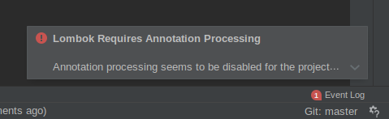
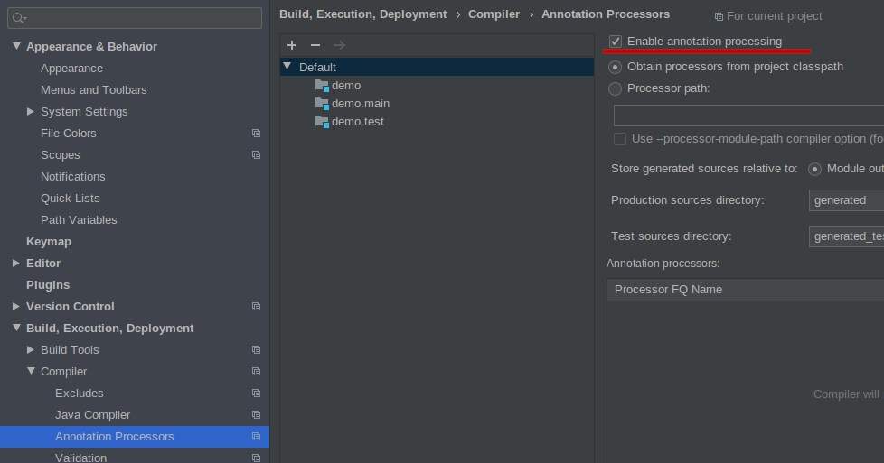

## Lombok

### OBJETIVO

- Conocer lombok

#### REQUISITOS

Un proyecto de spring boot creado con spring initializr con Lombok como dependencia

#### DESARROLLO

Lombok es un procesador de anotaciones que nos ahorra muchas cosas repetitivas, veamoslo con un ejemplo.

La primera vez que abrimos el proyecto en el IDE nos pedira que activemos el soporte para procesadores de anotaciones.

Una vez activado veamos los archivos [ConLombok.java](demo/src/main/java/com/example/demo/ConLombok.java) y [SinLombok.java](demo/src/main/java/com/example/demo/SinLombok.java) ambos archivos son equivalentes para nuestros propositos pero usando lombok nos ahorramos muchas cosas.

