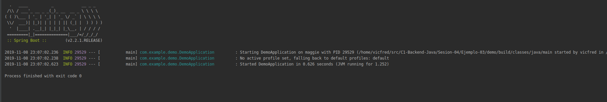
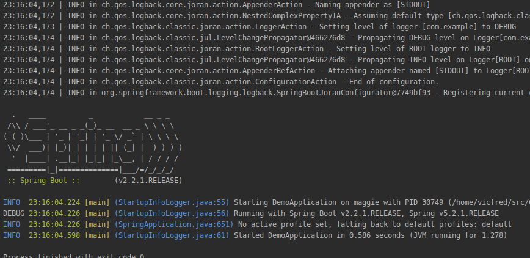

## Logeo con lombok

### OBJETIVO

- Como usar lombok para logear la actividad de nuestra aplicación.

#### REQUISITOS

1. Un proyecto de spring boot con la dependencia Lombok incluida.

#### DESARROLLO

Podemos anotar las clases de java con @Slf4j para tener acceso a un logger. Esto es mejor que imprimir usando System.out pues tenemos mejor control para configurarlo y esta organizado en varios niveles de logeo como `INFO`, `DEBUG` y `ERROR`.

Para configurarlo usamos un archivo en formato `xml` llamado `logback.xml` en la carpeta de resources. Primero veamos como luce nuestro logging por defecto con la configuración que nos proveé automaticamente spring boot.

Como de inicio nuestro proyecto no tiene un `logback.xml` spring boot nos da una configuración por defecto pero para personalizar el formato y la información del logging vamos a crear este archivo [logback.xml](demo/src/main/resources/logback.xml). En el podemos elegir que tanta información queremos, el formato y los colores.

Como podemos ver ahora el log esta mostrando mucha mas información que nos puede ser útil, también cambiamos el formato y los colores.

Para usar el logger en nuestro código podemos usar las funciones `log.info`, `log.debug` y `log.error` dependiendo sea el caso de lo que queremos logear como se muestra un ejemplo en [DemoApplication.java](demo/src/main/java/com/example/demo/DemoApplication.java)

