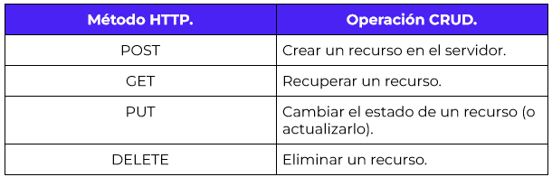
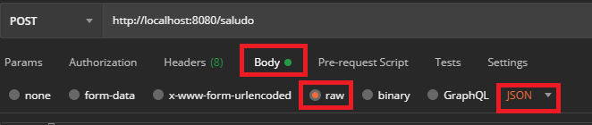

`Desarrollo Web` > `BackEnd Básico Java`

## 🧠 Ejemplo 03: Método POST para creación y actualización de información

### 🎯 OBJETIVO

- Aprender la forma en la que Spring MVC permite recibir objetos complejos (objetos con múltiples atributos de varios tipos)


### 📃 REQUISITOS

1. Tener **Gradle** instalado en el equipo
1. Tener instalado el JDK versión 11 o superior.
1. Tener un entorno de desarrolla (IDE) instalado en el equipo. Se recomienda IntelliJ Idea Community Edition
1. Tener instalada la herrramienta Postman en el equipo.


### 🎩 DESARROLLO

REST (Representational State Transfer) es un conjunto de principios que indican una forma de programar servicios web que aprovechan al máximo las características del protocolo HTTP.    

Uno de los puntos más importantes de REST es el uso de los métodos HTTP de forma explícita. Este principio establece una correlación individual entre las operaciones CRUD (crear, leer, actualizar y borrar) y los métodos HTTP. Según esta correspondencia:




Hasta el momento has aprendido a usar el métod **GET** para obtener recursos. En este ejemplo aprenderás a usar los dos siguientes métodos HTTP: **POST** para la creación de un nuevo recurso en el servidor y **PUT** para la actualización de ese recurso. 


#### Implementación

Crea un proyecto usando Spring Initializr desde el IDE IntelliJ Idea como lo hiciste en la primera sesión. Selecciona las siguientes opciones:

    Grupo, artefacto y nombre del proyecto.
    Tipo de proyecto: **Gradle**.
    Lenguaje: **Java**.
    Forma de empaquetar la aplicación: **jar**.
    Versión de Java: **11** o superior.


En la siguiente ventana elige Spring Web como la única dependencia del proyecto:


Presiona el botón `Finish`.

Dentro del paquete del proyecto crearemos un subpaquete que contendrá los controladores de Spring MVC.

Haz clic con el botón derecho del ratón sobre el paquete y en el menú que se muestra selecciona las opciones `New  -> Package`. Dale a este nuevo paquete el nombre de `controllers`.


Crea un segundo paquete llamado `model` a la misma altura que el paquete `controllers`. Al final debes tener dos paquetes adicionales:


Dentro del paquete `model` crea una nueva clase llamada `Saludo`. Esta clase representará el modelo de los datos que regresará el servicio que crearemos en un momento. Esta será una clase sencilla que tendrá tres propiedades, las primeas dos de tipo `String`: `mensaje` y `nombre`, y la tercera será de tipo `int`: `edad`. Además de estas propiedades la clase debe tener sus métodos **setter** y **getter**:

```java
public class Saludo {
    private String mensaje;
    private String nombre;
    private int edad;

    public String getMensaje() {
        return mensaje;
    }

    public void setMensaje(String mensaje) {
        this.mensaje = mensaje;
    }

    public String getNombre() {
        return nombre;
    }

    public void setNombre(String nombre) {
        this.nombre = nombre;
    }

    public int getEdad() {
        return edad;
    }

    public void setEdad(int edad) {
        this.edad = edad;
    }
}
```
En el paquete `controller` crea una nueva clase llamada `SaludoController`. Esta clase implementará los servicios web REST que manejan a los recursos de tipo `Saludo`. Para indicar a Spring que este componente es un servicio REST debemos decorar la case con la anotación `@RestController`:

```java
@RestController
public class SaludoController {

}
```

Esta clase tendrá un solo método o manejador de llamadas, el cual recibirá un parámetro de tipo `Saludo` y regresará también ese mismo recurso de tipo `Saludo` con un mensaje preestablecido.

```java
public Saludo saluda(Saludo saludo){
    return saludo;
}
```

Para indicar que este método es un manejador de peticiones debemos indicar qué tipo de operaciones manejará (el verbo HTTP que soportará). Como en este caso solo se usará para crear información, debes usar el verbo POST; En este caso la anotación que se usrá es @PostMapping a la cual hay que indicarle la URL de las peticiones que manejará. En este caso será la ruta saludo. El método queda de la siguiente forma:

```java
    @PostMapping("/saludo")
    public Saludo saluda(Saludo saludo){
        return saludo;
    }
```

Si ejecutas la aplicación de esta forma y luego haces una llamada desde Postman, todo funcionará (no habrá errores, ni excepciones y recibirás ua respuesta); sin embargo, en la respuesta que recibas todos los campos de `Saludo` estarán vacíos. Esto es porque hace falta indicarle a Spring MVC que el parámetro de tipo `Saludo` lo recibirá en el cuerpo de la petición, usando la anotación `@RequestBody`, de esta forma:

```java
    @PostMapping("/saludo")
    public Saludo saluda(@RequestBody Saludo saludo){
        return saludo;
    }
```


Abre postman y crea una nueva petición. Esta deberá ser una petición tipo POST a la URL `http://localhost:8080/saludo`:


En la pestaña `Body` selecciona la opción `Raw` como tipo de petición y `JSON` como formato de la misma:




Coloca el siguiente contenido en el cuerpo de la petición:

```json
{
    "mensaje": "Hola Mundo",
    "nombre": "Beto",
    "edad": 5
}
```

Presiona el botón `Send`. Al recibir la repuesta debes obtener el siguiente resultado:

