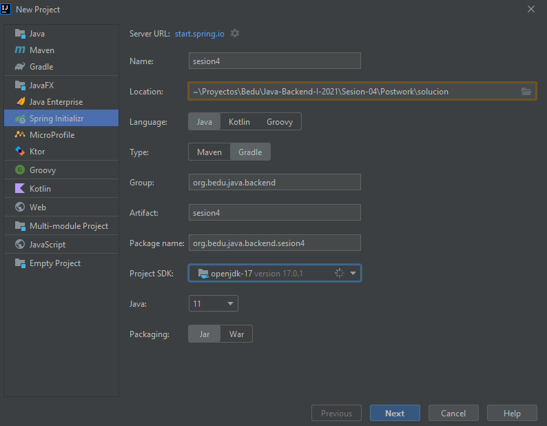
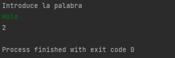

`Desarrollo Web` > `BackEnd Básico Java`

## 💪 Postwork: Aplicación de línea de comandos

### 🎯 OBJETIVO

- Implementar una aplicación de línea de comandos utilizando Spring Boot

### 📃 REQUISITOS

1. Tener **Gradle** instalado en el equipo
2. Tener un editor de código instalado en el equipo
3. Tener acceso a la terminal del equipo

### 💭 DESCRIPCIÓN

Dentro de las muchas bondades con las que cuenta en Framework de Spring, y en particular Spring Boot, se encuentra la opción de poder ejecutar comandos al momento de iniciar la aplicación. Gracias a esto puedes proporcionar algunas instrucciones, rutas, o valores particulares a tu aplicación.

En este postwork deberás implementar la interface `CommandLineRunner` que proporciona Spring Boot, para que por medio de línea de comandos reciba una cadena de texto y calcule el total de vocales que contiene el texto ingresado. Recuerda que para leer datos a través de una línea de comandos se utiliza la clase `Scanner` del paquete `java.util`.

Recuerda que en el archivo de configuración de Gradle debes agregar la siguiente línea:

```groovy
bootRun {
  standardInput = System.in
}
```
<details>
  <summary>Solución</summary>

  
Crea un proyecto usando Spring Initializr desde el IDE IntelliJ Idea como lo hiciste en la primera sesión. Selecciona las siguientes opciones:

    Grupo, artefacto y nombre del proyecto.
    Tipo de proyecto: **Gradle**.
    Lenguaje: **Java**.
    Forma de empaquetar la aplicación: **jar**.
    Versión de Java: **11** o superior.



En la siguiente ventana no selecciones ninguna dependencia; no las necesitaremos en este proyecto. Presiona el botón `Finish`.

Spring Initializr creará de forma automática una clase con el mismo nombre del proyecto y el postfijo `Application`, `SolucionApplication` en este ejemplo. Esa clase estará decorada con la anotación `@SpringBootApplication`. Modifica esta clase para hacer que implemente la interface `CommandLineRunner`

```java
@SpringBootApplication
public class SolucionApplication implements CommandLineRunner {

    public static void main(String[] args) {
        SpringApplication.run(SolucionApplication.class, args);
    }
}
```

Esta interface contiene solo un método 

```java
@Override
public void run(String... args) throws Exception {

}
```

Este se ejecutará de forma automática al momento de iniciar la aplicación. Coloca el siguiente código detro de la clase:

```java
@SpringBootApplication
public class SolucionApplication implements CommandLineRunner {

    public static void main(String[] args) {
        SpringApplication.run(SolucionApplication.class, args);
    }

    @Override
    public void run(String... args) throws Exception {
        Scanner reader = new Scanner(System.in);

        System.out.println("Introduce la palabra");
        String palabra = reader.next();

        System.out.println(cuentaVocales(palabra));
    }

    public static int cuentaVocales(String palabra)
    {
        int count = 0;
        for (int i = 0; i < palabra.length(); i++)
        {
            if (palabra.charAt(i) == 'a' || palabra.charAt(i) == 'e' || palabra.charAt(i) == 'i'
                    || palabra.charAt(i) == 'o' || palabra.charAt(i) == 'u')
            {
                count++;
            }
        }
        return count;
    }
}

```

Ejecuta la aplicación, debes obtener una salida como la siguiente al escribir la palabra en la consola del IDE:




La aplicación se dentendrá de forma automática cuando el resultado se imprima en pantalla.

</details>