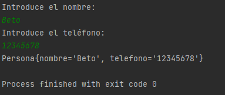

## Sesión 4: Aplicación de línea de comandos

### 🎯 OBJETIVO

- Implementar una aplicación de línea de comandos utilizando Spring Boot

### DESARROLLO

Dentro de las muchas bondades con las que cuenta en Framework de Spring, y en particular Spring Boot, se encuentra la opción de poder ejecutar comandos al momento de iniciar la aplicación. Gracias a esto puedes proporcionar algunas instrucciones, rutas, o valores particulares a tu aplicación.

En este postwork deberás implementar la interface `CommandLineRunner` que proporciona Spring Boot, para que por medio de línea de comandos reciba una cadena de texto y calcule el total de vocales que contiene el texto ingresado. Recuerda que para leer datos a través de una línea de comandos se utiliza la clase `Scanner` del paquete `java.util`.

Recuerda que en el archivo de configuración de Gradle debes agregar la siguiente línea:

```groovy
bootRun {
  standardInput = System.in
}
```
<details>
  <summary>Solución</summary>

  
Crea un proyecto usando Spring Initializr desde el IDE IntelliJ Idea como lo hiciste en la primera sesión. Selecciona las siguientes opciones:

    Grupo, artefacto y nombre del proyecto.
    Tipo de proyecto: **Gradle**.
    Lenguaje: **Java**.
    Forma de empaquetar la aplicación: **jar**.
    Versión de Java: **11** o superior.


En la siguiente ventana no selecciones ninguna dependencia; no las necesitaremos en este proyecto. Presiona el botón `Finish`.

Spring Initializr creará de forma automática una clase con el mismo nombre del proyecto y el postfijo `Application`, `SolucionApplication` en este ejemplo. Esa clase estará decorada con la anotación `@SpringBootApplication`. Modifica esta clase para hacer que implemente la interface `CommandLineRunner`

```java
@SpringBootApplication
public class SolucionApplication implements CommandLineRunner {

    public static void main(String[] args) {
        SpringApplication.run(SolucionApplication.class, args);
    }
}
```

`CommandLineRunner` contiene un solo método el cual se ejecuta al momento de iniciar la aplicación. Es dentro de este método donde deberás colocar el código de la aplicación.

```java
@Override
public void run(String... args) throws Exception {

}
```

En el cuerpo de `run` usa una instancia de `Scanner` para leer la entrada que el usaurio proporcione a través de la entrada estándar (el teclado). Aquí deberás leer el texto introducido y luego recorrerlo para encontrar las vocales.

```java
@SpringBootApplication
public class SolucionApplication implements CommandLineRunner {

    public static void main(String[] args) {
        SpringApplication.run(SolucionApplication.class, args);
    }

    @Override
    public void run(String... args) throws Exception {
        Scanner reader = new Scanner(System.in);

        System.out.println("Introduce la palabra: ");
        String palabra = reader.nextLine();

        System.out.println(cuentaVocales(palabra));
    }
}

```

Ahora implementa el método `cuentaVocales`. Puedes hacerlo tan complejo como quieras. Este es un ejemplo:

```java
  public static int cuentaVocales(String palabra) {
        int vocales = 0;
        for (int i = 0; i < palabra.length(); i++) {
            if (palabra.charAt(i) == 'a' ||
                    palabra.charAt(i) == 'e' ||
                    palabra.charAt(i) == 'i' ||
                    palabra.charAt(i) == 'o' ||
                    palabra.charAt(i) == 'u') {
                vocales++;
            }
        }
        return vocales;
    }
```

Ejecuta la aplicación. Si lo haces desde IntelliJ Idea deberás hacer click en la consola y comenzar a escribir:




La aplicación se dentendrá de forma automática cuando el resultado se imprima en pantalla.

</details>