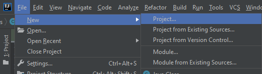

`Desarrollo Web` > `BackEnd Básico Java`

## 💪 Reto 01: Proyecto Spring Boot desde IntelliJ Idea

### 🎯 OBJETIVO

- Crear un proyecto Maven usando Spring Initializr desde IntelliJ Idea.
- Compilar, empaquetar y ejecutar la aplicación o proyecto generados desde el IDE.

### 📃 REQUISITOS

1. Tener instalado el JDK versión 11 o superior.
1. Tener Idea Community Edition instalado en el equipo.

### 💭 DESCRIPCIÓN

La ventaja que nos ofrece un Entorno de desarrollo integrado, IDE por sus siglas en inglés, como IntelliJ Idea es que combina en una sola herramienta todas las opciones que necesitamos para la creación de proyectos de cualquier framework que soporte el lenguaje de programación Java. Dentro de esta enorme lista se encuentra Spring Boot que, como viste en el primer ejercicio, permite el desarrollo de aplicaciones web de una forma muy sencilla.

Spring Initlizr es un sitio que nos permite la creación de un proyecto Spring Boot usando Maven o Gradle como herramientas de construcción del proyecto. Además de que permite la selección de la dependencias del mismo y se encarga de configurarlas para que en cuestión de segundos podamos tener el esqueleto funcional de una aplicación.

En este reto tendrás que crear una aplicación sencilla desde el entorno de desarrollo integrado. No es necesario agregar ninguna funcionalidad inicial, ya que lo que queremos comprobar es que la aplicación está bien configurada y puede ejecutarse de forma exitosa. Para comprobar esto, deberas ver una pantalla como la siguiente al momento de ingresar a la URL: http://localhost:8080

¡Buena suerte!

  
Solución

Abre el IDE IntelliJ Idea. Crea un nuevo proyecto usando el menú `New -> Project`. 

En el menú que se abre selecciona la opción `Spring Initializr` y como SDK Java **11** o superior.

En la ventana que se abre selecciona las siguientes opciones: 
- Grupo, artefacto y nombre del proyecto.
- Tipo de proyecto: **Maven Proyect**.
- Lenguaje: **Java**.
- Forma de empaquetar la aplicación: **jar**.
- Versión de Java: **11** o **17**.

En la siguiente ventana selecciona Spring Web como dependencia para el proyecto. 

Presiona el botón `Finish`. Con esto se creará un nuevo proyecto que tiene la siguiente estructura:

En esta sesión no modificaremos nada del código que el IDE ha creado de forma automática, eso lo dejaremos para la siguiente sesión.

El siguiente paso es compilar el código de la aplicación. Para hacerlo ve al panel llamado **Gradle** que se encuentra del lado derecho del IDE. Es posible que este panel se encuentre minimizado, como se muestra en la siguiente imagen:

Para abrirlo solo haz clic sobre el nombre del panel, con esto debe desplegarse como se muestra en la siguiente imagen:

Ahora, para compilar el código de  aplicación y generar el archivo `jar` que permite la ejecución de esta hay que  doble clic sobre el elemento `bootJar` (con lo que se le indica a Maven que este es el último paso del ciclo de vida de construcción de la aplicación que debe ejecutar).

En el panel de salida del IDE debemos ver un mensaje como el siguiente, que indica que la aplicación se compiló y ejecutó correctamente:

Finalmente, para ejecutar la aplicación debemos presionar el botón de la flecha verde situado en la parte superior del IDE.

Con esto debemos ver una salida similar a la siguiente en el panel de salida del IDE:

Esto indica que la aplicación se levantó correctamente en el puerto **8080**.

  http://localhost:8080

Una vez que el sitio cargue, debes ver una pantalla como la siguiente:

Detén la aplicación presionando el botón del cuadro rojo en el panel de salida del IDE.

