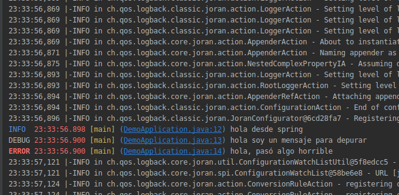
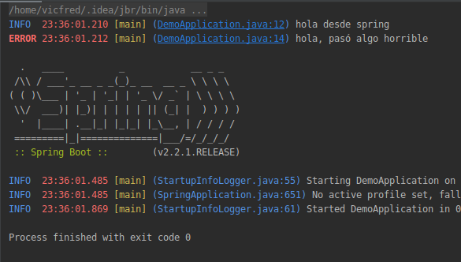

## Logeo con lombok

### OBJETIVO 

- Hacer uso de lombok para logear y personalizar el formato del logging.

#### REQUISITOS 

El ejemplo 3.

#### DESARROLLO

- Agrega un mensaje de debug
- Agrega un mensaje de error

- Cambia el archivo [logback.xml](solucion/src/main/resources/logback.xml) para que use rojo en lugar de verde.

Ejecuta el programa, en este momento deberian mostrarse 3 mensajes de logeo. (Hay que buscarlos bien entre tanta información)

- Cambia el archivo [logback.xml](solucion/src/main/resources/logback.xml) para que use rojo en lugar de verde.

- Cambia el archivo [logback.xml](solucion/src/main/resources/logback.xml) para que que muestre un nivel de logeo `INFO`, esto hará que los mensajes de nivel `DEBUG` ya no se muestren.

#### Solución

Ver la carpeta [solucion](solucion)

