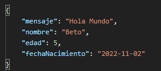
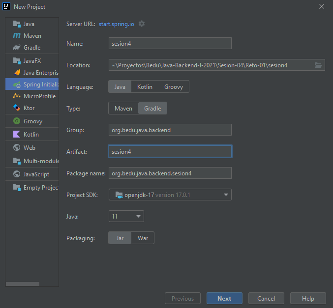
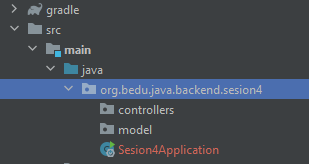
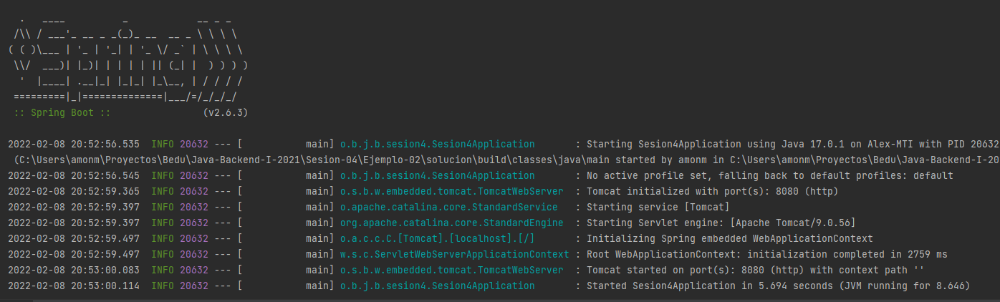

`Desarrollo Web` > `BackEnd Básico Java`

## 💪 Reto 03: Controladores PUT para actualización de información

### 🎯 OBJETIVO

- Aprender la forma de crear manejadores de peiticiones para actualizar información.
- Manejar parámetros relacionados con fechas.
- Consumir el servicio usando un navegador Web y con Postman.


### 📃 REQUISITOS

1. Tener **Gradle** instalado en el equipo
1. Tener instalado el JDK versión 11 o superior.
1. Tener un entorno de desarrolla (IDE) instalado en el equipo. Se recomienda IntelliJ Idea Community Edition.
1. Tener Postman instalado en el equipo.


### 💭 DESCRIPCIÓN

En el ejemplo anterior creamos un controlador que recibía un parámetro en el cuerpo de la petición a través de un manejador **POST**. Para este reto deberás realizar una tarea similar, pero usando un método **PUT** y agregando un parámetro adicional en el cuerpo de la petición. Este parámetro será una fecha la cual deberás sumarle un día y regresarla como respuesta de la petición. Eso quiere decir que si envias como parámetro el 1 de noviembre del 2023, deberás obtener den la respuesta el 2 de noviembre del 2023.

Seguiremos usando la clase `Saludo` con la que hemos trabajado toda esta sesión, pero le agregaremos este nuevo parámetro, por lo que la clase deberá tener los siguientes parámetros:

```java
public class Saludo {
    private String mensaje;
    private String nombre;
    private int edad;
    private LocalDate fechaNacimiento;
}
```
Deberás validar el correcto funcionamiento de la aplicación usando la herramienta Postman y desde el navegador.

La salida debe ser como la siguiente:



¡Buena suerte!


<details>
  <summary>Solución</summary>

Lo primero es crear un proyecto usando Spring Initializr desde el IDE IntelliJ Idea. Selecciona las siguientes opciones:

    Grupo, artefacto y nombre del proyecto.
    Tipo de proyecto: **Gradle**.
    Lenguaje: **Java**.
    Forma de empaquetar la aplicación: **jar**.
    Versión de Java: **11** o superior.



En la siguiente ventana elige Spring Web como la única dependencia del proyecto:


Presiona el botón `Finish`.

Dentro del paquete del proyecto crea un subpaquete que contendrá los controladores de Spring MVC.

Haz clic con el botón derecho del ratón sobre el paquete y en el menú que se muestra selecciona las opciones `New  -> Package`. Dale a este nuevo paquete el nombre de `controllers`.


Crea un segundo paquete llamado `model` a la misma altura que el paquete `controllers`. Al final debes tener dos paquetes adicionales:



Dentro del paquete `model` crea la clase `Saludo` que se encuentra en la descripción del reto, no olvides agregar sus métodos *setter* y su método *getter*:    

```java
public class Saludo {
    private String mensaje;
    private String nombre;
    private int edad;
    private LocalDate fechaNacimiento;

    public String getMensaje() {
        return mensaje;
    }

    public void setMensaje(String mensaje) {
        this.mensaje = mensaje;
    }

    public String getNombre() {
        return nombre;
    }

    public void setNombre(String nombre) {
        this.nombre = nombre;
    }

    public int getEdad() {
        return edad;
    }

    public void setEdad(int edad) {
        this.edad = edad;
    }

    public LocalDate getFechaNacimiento() {
        return fechaNacimiento;
    }

    public void setFechaNacimiento(LocalDate fechaNacimiento) {
        this.fechaNacimiento = fechaNacimiento;
    }
}
```


En el paquete `controller` crea una nueva clase llamada `SaludoController`. Esta clase implementará los servicios web REST que manejan a los recursos de tipo `Saludo`. Para indicar a Spring que este componente es un servicio REST debemos decorar la case con la anotación `@RestController`:

```java
@RestController
public class SaludoController {

}
```

Esta clase tendrá, en este momento, un  solo método o manejador de llamadas, el cual no recibirá ningún parámetro y regresará un recurso de tipo `Saludo` con un mensaje preestablecido.

```java
public Saludo saluda(Saludo saludo){
    return saludo;
}
```

Para indicar que este método es un manejador de peticiones debemos indicar qué tipo de operaciones manejará (el verbo HTTP que soportará) en este caso se usará el verbo **PUT**. La anotación que se usa es `@PutMapping` a la cual hay que indicarle la URL de las peticiones que manejará. En este caso será la ruta saludo. No olvides indicarle a Spring MVC que el parámetro de tipo Saludo lo recibirá en el cuerpo de la petición, usando la anotación `@RequestBody`:


Hasta ahora el método se ve así:

```java
    @PutMapping("/saludo")
    public Saludo saluda(@RequestBody Saludo saludo){
        return saludo;
    }
```

Ahora, modifica el cuerpo del método para agregar la lógica que añade un día a la fecha recibida. El método completo queda de la siguiente forma:

```java
    @PutMapping("/saludo")
    public Saludo saluda(@RequestBody Saludo saludo){

        saludo.setFechaNacimiento(saludo.getFechaNacimiento().plusDays(1));

        return saludo;
    }
```

Ejecuta la aplicación, en la consola del IDE debes ver un mensaje similar al siguiente:



Esto quiere decir que la aplicación se ejecutó correctamente y todo está bien configurado.

Ahora, in Postman crea una nueva petición de tipo PUT hacia la URL [http://localhost:8080/saludo](http://localhost:8080/saludo). En la pestaña Body selecciona la opción Raw como tipo de petición y JSON como formato de la misma. Coloca el siguiente contenido en el cuerpo de la petición:

```json
{
    "mensaje": "Hola Mundo",
    "nombre": "Beto",
    "edad": 5,
    "fechaNacimiento": "2022-11-01"
}
```

Presiona el botón `Send`. Una vez que recibas la respuesta, debes ver una salida similar en el panel de respuestas:


</details>