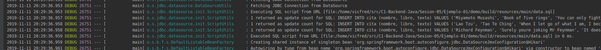

## JDBC con H2

### OBJETIVO

- Usar una base de datos embebida en memoria con spring.

#### REQUISITOS

Un proyecto de spring boot creado con initializr usando las dependencias `JDBC API`, `H2 Database` y `Lombok`.

#### DESARROLLO

Ahora empezaremos a usar una base de datos en nuestras aplicaciones. Instalar un sistema de bases de datos depende mucho de la plataforma por eso usaremos una base de datos embebida de manera provisional mientras no tengamos un sistema de bases de datos instalado.

Para esto lo unico que tenemos que hacer es un proyecto de spring boot con initializr y seleccionar las dependencias `JDBC API`, `H2 Database` y `Lombok`, esto nos proporcionará de manera automatica una base de datos embebida a la memoria ram que podemos usar de manera temporal mientras corra nuestra aplicación.

Una vez abierto el proyecto en nuestro IDE podemos definir el esquema de la base de datos en el archivo [schema.sql](demo/src/main/resources/schema.sql) e insertar datos con el archivo [data.sql](demo/src/main/resources/data.sql) lo cuales son leidos y ejecutados automaticamente por spring boot al iniciar la aplicación. Podemos configurar esto poniendo el nivel del logeo en `DEBUG` en el archivo [application.properties](demo/src/main/resources/application.properties)

Una vez configurada la base de datos podemos hacer uso de ella mediante JdbcTemplate. Antes de eso hacemos una interface para que nuestra aplicación no dependa de una implementación en particular y haremos una implementación de esta interface usando JdbcTemplate como podemos ver en [data](demo/src/main/java/com/example/demo/data).

Para trabajar con JdbcTemplate de manera comoda creamos una clase `Cita` [Cita.java](demo/src/main/java/com/example/demo/Cita.java)

En el archivo [JdbcCitaRepository.java](demo/src/main/java/com/example/demo/data/JdbcCitaRepository.java) vemos como hacer un `select` y un `insert` a la base de datos.

Por ultimo creamos un controlador que va a usar este repositorio [CitaController.java](demo/src/main/java/com/example/demo/controllers/CitaController.java).

