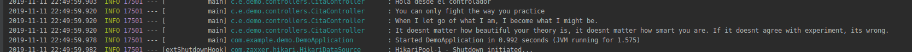

## JDBC con PostgreSQL

### OBJETIVO

- Usar una base de datos PostgreSQL con spring.

#### REQUISITOS

Tener PostgreSQL configurando y corriendo.

Un proyecto de spring boot creado con initializr usando las dependencias `JDBC API`, `PostgreSQL Driver` y `Lombok`.

#### DESARROLLO

Ahora usaremos un sistema de bases de datos mas robusto `PostgreSQL`, para esto es necesario primero instalarlo en tu plataforma y notar el puerto en el que corre, el usuario y la contraseña.

Vamos a usar estos datos para decirle a spring sobre el servidor de PostgreSQL en el archivo [configuration.properties](demo/src/main/resources/application.properties).

Una vez abierto el proyecto en nuestro IDE podemos definir el esquema de la base de datos en el archivo [schema.sql](demo/src/main/resources/schema.sql) e insertar datos con el archivo [data.sql](demo/src/main/resources/data.sql). Podemos configurar esto poniendo el nivel del logeo en `DEBUG` en el archivo [application.properties](demo/src/main/resources/application.properties)

Una vez configurada la base de datos podemos hacer uso de ella mediante JdbcTemplate. Antes de eso hacemos una interface para que nuestra aplicación no dependa de una implementación en particular y haremos una implementación de esta interface usando JdbcTemplate como podemos ver en [data](demo/src/main/java/com/example/demo/data).

Para trabajar con JdbcTemplate de manera comoda creamos una clase `Cita` [Cita.java](demo/src/main/java/com/example/demo/Cita.java)

En el archivo [JdbcCitaRepository.java](demo/src/main/java/com/example/demo/data/JdbcCitaRepository.java) vemos como hacer un `select` y un `insert` a la base de datos.

Por ultimo creamos un controlador que va a usar este repositorio [CitaController.java](demo/src/main/java/com/example/demo/controllers/CitaController.java).

