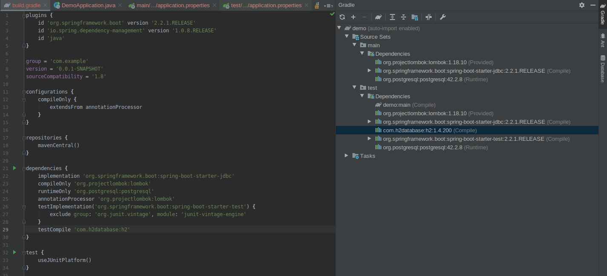
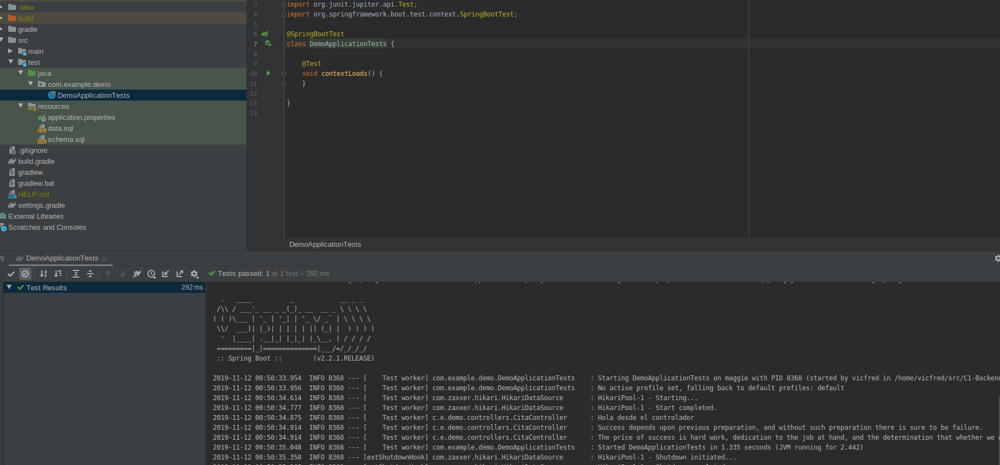

## La base de datos en pruebas

### OBJETIVO

- Usar una base diferente en pruebas

#### REQUISITOS

El codigo del ejemplo 2 agregando la dependencia de `H2 Database` en el `application.properties`

#### DESARROLLO

Usar la misma base de datos que se usa para la aplicación y para las pruebas no es recomendable por muchas razones así que usaremos una base de datos ligera y desechable para nuestras pruebas. En este caso usaremos H2 para pruebas y PostgreSQL para la aplicación.

Comenzando con el ejemplo 2 como base agregamos la dependencia a H2 pero sólo para pruebas. Esto lo logramos modificando el archivo [build.gradle](demo/build.gradle)

Una vez que gradle este listo agregaremos archivos [application.properties](demo/src/test/resources/application.properties), [data.sql](demo/src/test/resources/data.sql) y [schema.sql](demo/src/test/resources/schema.sql) en el directorio [demo/src/test/resources/](demo/src/test/resources/). Estos archivos toman prioridad sobre los archivos de la aplicación cuando corremos las pruebas y de esta manera no modificaremos por accidente los datos de la aplicación.

Una vez hecha esta configuración podemos correr los tests desde el IDE desde el archivo [DemoApplicationTests.java](demo/src/test/java/com/example/demo/DemoApplicationTests.java)

Como podemos notar se cargaron las citas del archivo de pruebas y no las de la aplicación.

