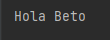

## 🧠 Ejemplo 03: Inicialización de propiedades

### 🎯 OBJETIVO

- Inicializar los valores de un objeto adminsitrado por Spring, después de que este ha sido creado.


### 🎩 DESARROLLO

Crea un proyecto usando Spring Initializr desde el IDE IntelliJ con las siguientes opciones:

  - Gradle Proyect (no te preocupes, no es necesario que tengas Gradle instalado).
  - Lenguaje: **Java**.
  - Versión de Spring Boot, la versión estable más reciente
  - Grupo, artefacto y nombre del proyecto.
  - Forma de empaquetar la aplicación: **jar**.
  - Versión de Java: **11** o superior.

No selecciones ninguna dependencia, no las necesitaremos en este ejemplo.

Presiona el botón "Finish".

Ahora, crea dos paquetes dentro de la estructura creada por IntelliJ. El primer paquete se llamará `model` y el segundo `service`:



Dentro del paquete `model` crea una nueva clase llamada `Saludo`. Esta representa al Bean que inyectaremos más adelante en este ejemplo:

```java
public class Saludo {
    private String nombre;

    public void setNombre(String nombre) {
        this.nombre = nombre;
    }

    public String getNombre() {
        return nombre;
    }
}
```

Este `Saludo` no es como los anteriores, ya que no hemos establecido el valor de la propiedad `nombre`. Además, hemos eliminado y constructor y hemos agregado un método `setter`. Esto es porque ahora modificaremos el valor del nombre una vez que el objeto haya sido inyectado en el servicio correspondiente.

Como queremos que `Saludo` sea manejado como un Bean de Spring, lo indicamos con la anotación `@Component`. 


```java
@Component
public class Saludo {
    private String nombre;

    public void setNombre(String nombre) {
        this.nombre = nombre;
    }

    public String getNombre() {
        return nombre;
    }
}

```

Dentro del paquete `service` crea una clase llamada `SaludoService`. Esta clase usará la instancia de `Saludo` y será la responsable de configurar el nombre que se usará en esa instancia. Como esta clase será interpretada como un **servicio** debemos decorarla con la anotación `@Service`, otra de las anotaciones de estereotipos de Spring:

```java
@Service
public class SaludoService {

}
```

A continuación, indicamos que este servicio usa la instancia de `Saludo` y que Spring debe inyectarlo:

```java
@Service
public class SaludoService {

    private final Saludo saludo;

    @Autowired
    public SaludoService(Saludo saludo) {
        this.saludo = saludo;
    }
}
```

Para terminar con `SaludoService`, agregamos un método `saluda` que haga uso de esta instancia:

```java
public String saluda(){
  return "Hola " + saludo.getNombre();
}
```

Si intentáramos ejecutar la aplicación de esta forma obtendriamos "Hola null", ya que el valor de `nombre` no ha sido inicializado (es una valor nulo).


Como no podemos (o queremos) crear directamente la instancia de `Saludo` dejaremos que `SaludoService` establezca el valor de `nombre`. Para ello crearemos un método de inicialización el cual se ejecutará una vez que se haya creado la instancia de `SaludoService` y se haya inyectado `Saludo`. 

```java
    public void init(){
        saludo.setNombre("Beto");
    }
```

Para indicarle a Spring que debe invocar este método una vez que se hayan inicializado los Beans, lo decoramos con la anotación `@PostConstruct`

```java
    @PostConstruct
    public void init(){
        saludo.setNombre("Beto");
    }
```

Hagamos uso de esta Bean en otra parte de nuestra aplicación.

vamos a la clase principal, `Sesion5Application`, la cual está decorada con la anotación `@SpringBootApplication`. Es en esta clase donde le indicaremos a Spring que debe inyectar la instancia de `SaludoService`. Para eso declararemos un atributo de tipo `SaludoService`, de la misma forma que en el ejemplo anterior:

```java
@SpringBootApplication
public class Sesion5Application {

   private final SaludoService saludoService;

    public Sesion5Application(@Autowired SaludoService saludoService) {
        this.saludoService = saludoService;
    }
}
```

Haremos es hacer que `Sesion5Application` implemente la interface `CommandLineRunner`, y en su método `run` imprimiremos el valor del atributo `nombre` de saludo, usando la instancia de `SaludoService`:

```java
@SpringBootApplication
public class Sesion5Application implements CommandLineRunner {

    private final SaludoService saludoService;

    public Sesion5Application(@Autowired SaludoService saludoService) {
        this.saludoService = saludoService;
    }

    public static void main(String[] args) {
        SpringApplication.run(Sesion5Application.class, args);
    }


    @Override
    public void run(String... args) throws Exception {
        System.out.println(saludoService.saluda());
    }
}

```

Si ahora ejecutamos la aplicación, debemos obtener la siguiente salida en la consola:


