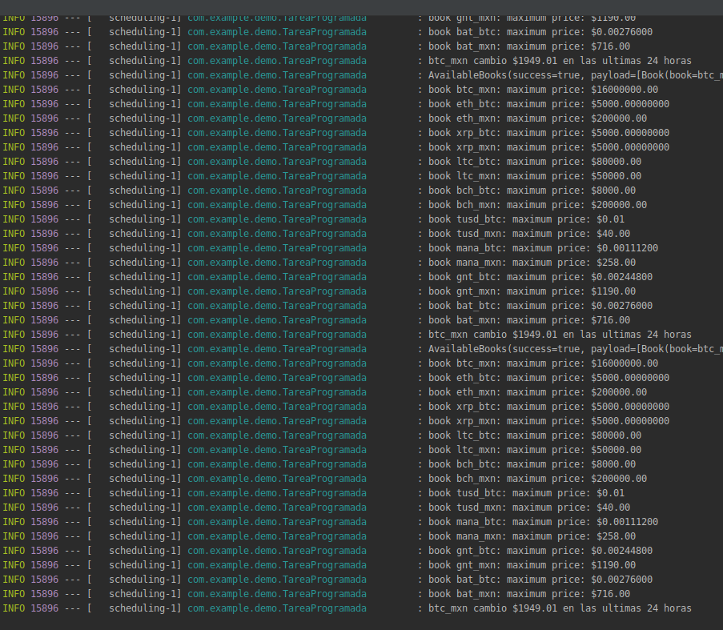

## GET Request

### OBJETIVO

Aprender los casos comunes para hacer peticiones `GET`

#### REQUISITOS

El código del ejemplo 1

#### DESARROLLO

Vamos a hacer una tarea programada que haga peticiones `GET` y reporte algo de información.

En la clase [TareaProgramada.java](demo/src/main/java/com/example/demo/TareaProgramada.java) el método `getBooks()` tenemos un ejemplo de una petición GET sin argumentos y en el método `getTicker()` tenemos una petición que toma argumentos.

Notemos las clases [TickerResponse.java](demo/src/main/java/com/example/demo/TickerResponse.java) y [Ticker.java](demo/src/main/java/com/example/demo/Ticker.java), usamos estas clases para parsear la respuesta y usamos la anotación `@Data` de Lombok para generar los setters/getters necesarios y los metodos `toString()` que los convierten a cadenas.

