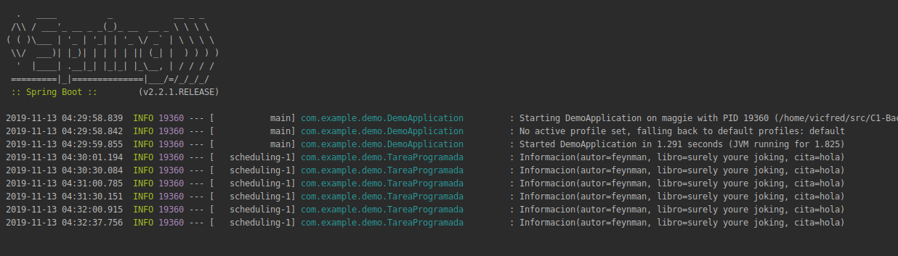

## POST Request

### OBJETIVO

Hacer una petición con el método `POST`

#### REQUISITOS

El código del ejemplo 1

#### DESARROLLO

Ahora vamos a hacer una petición `POST` vamos a usar un servicio como prueba que lo único que hace es devolver la información que le mandamos con el método `POST` [https://jsonplaceholder.typicode.com/](https://jsonplaceholder.typicode.com/)

Para mandar la información usaremos un objeto así como hicimos cuando recibimos información, en este caso como es el mismo tipo de información solo hace falta hacer una clase [Informacion.java](demo/src/main/java/com/example/demo/Informacion.java) la cual anotamos con `@Data`.

El ejemplo de la petición `POST` la hacemos una tarea programada [TareaProgramada.java](demo/src/main/java/com/example/demo/TareaProgramada.java)

