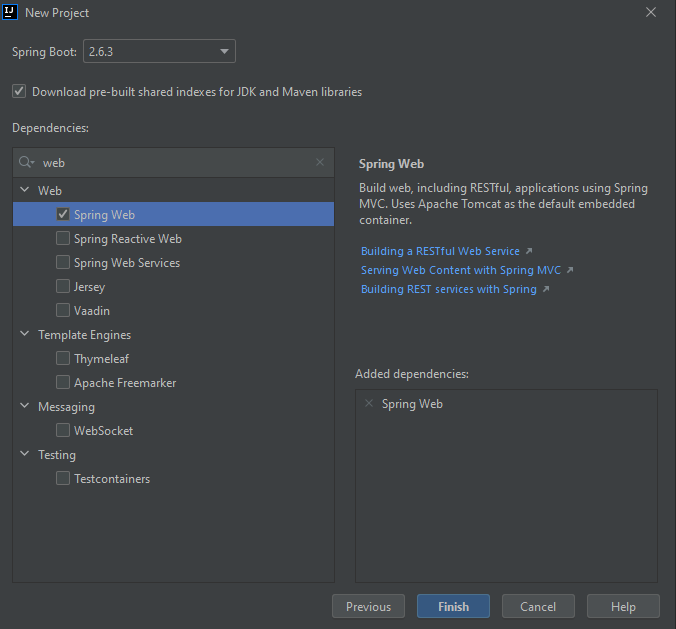
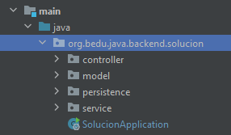

## Sesión 6: Introducción a Spring MVC

### OBJETIVO

- Extender el programa de línea de comandos para utilizar un controlador Web

### DESARROLLO

En el Postwork de la sesión anterior implementamos una aplicación que se ejecutaba en la línea de comandos y que contaba las letras y palabras más se repetian en el texto.

En ésta ocasión tu misión será extender este programa eliminando la línea de comandos y sustituyéndolo por un controlador web. 

1. El controlador deberá recibir la palabra en el cuerpo de una petición HTTP **POST**.
1. Debe regresar un objeto JSON con los dos valores calculados.
1. Prueba con Postman tu servicio para comprobar que obtienes los valores correctos.

Recueda que esta implementación también debe estar contenida en una clase “servicio” que deberá ser inyectada en la clase principal.

<details>
  <summary>Solución</summary>

  
Crea un proyecto usando Spring Initializr desde el IDE IntelliJ Idea como lo hiciste en la primera sesión. Selecciona las siguientes opciones:

    Grupo, artefacto y nombre del proyecto.
    Tipo de proyecto: **Gradle**.
    Lenguaje: **Java**.
    Forma de empaquetar la aplicación: **jar**.
    Versión de Java: **11** o superior.



En la siguiente ventana no selecciones ninguna dependencia; no las necesitaremos en este proyecto. Presiona el botón `Finish`.

Spring Initializr creará de forma automática una clase con el mismo nombre del proyecto y el postfijo `Application`, `SolucionApplication` en este ejemplo. Esa clase estará decorada con la anotación `@SpringBootApplication`. Modifica esta clase para hacer que implemente la interface `CommandLineRunner`

```java
@SpringBootApplication
public class SolucionApplication implements CommandLineRunner {

    public static void main(String[] args) {
        SpringApplication.run(SolucionApplication.class, args);
    }
}
```

`CommandLineRunner` contiene un solo método el cual se ejecuta al momento de iniciar la aplicación. Es dentro de este método donde deberás colocar el código de la aplicación.

```java
@Override
public void run(String... args) throws Exception {

}
```

En el cuerpo de `run` usa una instancia de `Scanner` para leer la entrada que el usaurio proporcione a través de la entrada estándar (el teclado). Aquí deberás leer el texto introducido y luego recorrerlo para encontrar las vocales.

```java
@SpringBootApplication
public class SolucionApplication implements CommandLineRunner {

    public static void main(String[] args) {
        SpringApplication.run(SolucionApplication.class, args);
    }

    @Override
    public void run(String... args) throws Exception {
        Scanner reader = new Scanner(System.in);

        System.out.println("Introduce la palabra: ");
        String palabra = reader.nextLine();

        System.out.println(cuentaVocales(palabra));
    }
}

```

Ahora implementa el método `cuentaVocales`. Puedes hacerlo tan complejo como quieras. Este es un ejemplo:

```java
  public static int cuentaVocales(String palabra) {
        int vocales = 0;
        for (int i = 0; i < palabra.length(); i++) {
            if (palabra.charAt(i) == 'a' ||
                    palabra.charAt(i) == 'e' ||
                    palabra.charAt(i) == 'i' ||
                    palabra.charAt(i) == 'o' ||
                    palabra.charAt(i) == 'u') {
                vocales++;
            }
        }
        return vocales;
    }
```

Ejecuta la aplicación. Si lo haces desde IntelliJ Idea deberás hacer click en la consola y comenzar a escribir:




La aplicación se dentendrá de forma automática cuando el resultado se imprima en pantalla.

</details>