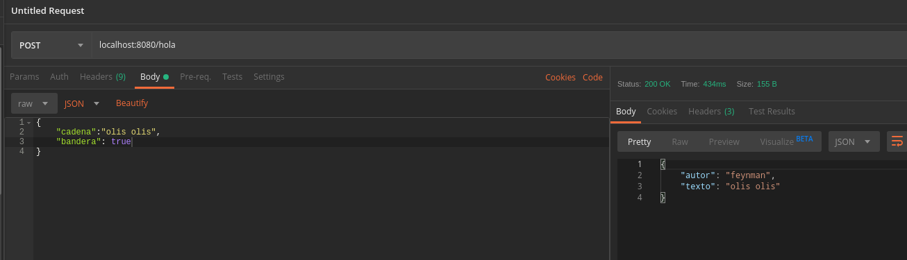

## Peticiones POST

### OBJETIVO

Como manejar peticiones HTTP por el método POST

#### REQUISITOS

Un proyecto de spring boot creado con initializr con las dependencias `LOMBOK` y `Spring Web`

#### DESARROLLO

Una vez abierto el proyecto en el IDE harémos un controlador que maneje peticiones `POST`.

En el caso de una petición `POST` generalmente recibimos algo como contenido junto con la petición, podemos ligar este contenido a un objeto y spring hara el parseo, lo único que tenemos que hacer el crear un objeto deacuerdo al contenido que vayamos a recibir. [MiControlador.java](demo/src/main/java/com/example/demo/MiControlador.java)

El objeto en este caso será modelado con la clase [Peticion.java](demo/src/main/java/com/example/demo/Peticion.java) y lo esperamos en formato `JSON`, de igual manera creamos un objeto [Cita.java](demo/src/main/java/com/example/demo/Cita.java) y lo regresamos como `JSON`. Para que haga la conversión a este formato usamos los parametros `consumes` y `produces` de la anotación `@PostMapping`

Para probarlo no usaremos el navegador web, esta vez usaremos una herramienta llamada `postman` que nos ayudará a hacer peticiones `POST` (o de otros tipos).

