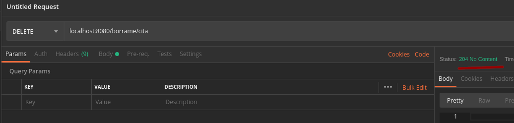

## Peticiones DELETE

### OBJETIVO

Manejar una petición `DELETE` y regresar un código de respuesta.

#### REQUISITOS

Un proyecto de spring boot creado con initializr con las dependencias `Lombok` y `Spring Web`

#### DESARROLLO

Usamos el método `DELETE` para manejar peticiones que tienen que ver con borrar ciertos datos, en este caso solo la recibimos y como para este proyecto no tenemos configurada una base de datos o algo que borrar solo lo logeamos. Notemos que usamos el parametro `code` para regresar un código de respuesta. [MiControlador.java](demo/src/main/java/com/example/demo/MiControlador.java)

Podemos usar de nuevo `postman` para hacer una petición `DELETE`.

