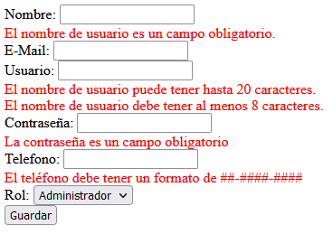

## Reto 02: Mensajes de error

### OBJETIVO

- Indicar en la página web cuando ocurra un error de validación, y darle suficiente información al usuario para que corrija por si mismo el error.

### DESARROLLO

Ya hemos validado que la información introducida por el usuario dentro del formulario cumpla con el formato que estamos esperando. Ahora es momento de que le indiques al usuario en caso de que haya cometido un error, cómo puede corregir la información para continuar con el procesamiento del mismo.

Recuerda que para eso debes usar los elementos correspondientes de Thymeleaf.

El resultado final debe verse así:

¡Buena suerte!

---

### Solución

¡Recuerda intentar resolver el reto antes de ver la solución! Una vez que lo hayas intentado puedes dirijirte al [proyecto con la solución](./solucion).