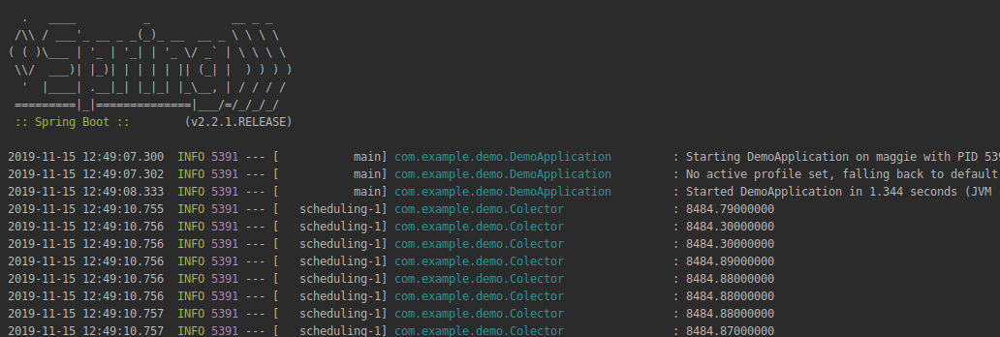

## Obtener datos de una api

### OBJETIVO

Obtener datos de una api para posteriormente guardarlos, procesarlos y exponerlos.

#### REQUISITOS

Un proyecto de spring boot creado usando initializr con las dependencias `Lombok` y `Spring Web`

#### DESARROLLO

Vamos a obtener los datos de las transacciones mas recientes de un exchange de criptomonedas [Binance](https://www.binance.com/en), la documentación de su API la podemos encontrar en [Documentacion](https://github.com/binance-exchange/binance-official-api-docs/blob/master/rest-api.md).

El endpoint que nos da esta información es [Recent trades list](https://github.com/binance-exchange/binance-official-api-docs/blob/master/rest-api.md#recent-trades-list) el cual no dice la ruta y los parametros que necesita nuestra petición.

Vamos a obtener los datos cada 5 minutos, para esto usaremos una tarea programada en la clase [Colector.java](demo/src/main/java/com/example/demo/Colector.java).

Notemos la inyección de la dependencia `RestTemplate` con `@Autowired` la cual se registró en la clase [ProveoBeans.java](demo/src/main/java/com/example/demo/ProveoBeans.java), también notemos que para parsear la respuesta en `JSON` que nos regresa la petición usamos una clase de java que nosotros creamos [Transaccion.java](demo/src/main/java/com/example/demo/Transaccion.java).

El objetivo es guardar esta información en una base de datos, procesarla y exponerla pero por ahora para comprobar que recibimos y parseamos bien la información solo logearemos los precios usando `log.info` el cual obtuvimos con la anotación `@Slf4j`.

También por ahora configuramos el nivel de logeo de toda la aplicación y el de nuestras clases para que nos muestre solo información que consideramos útil, esto lo hacemos en el archivo [application.properties](demo/src/main/resources/application.properties).

```
logging.level.root=ERROR
logging.level.com.example.demo=INFO
```


