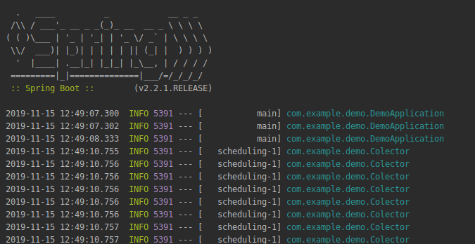

## Guardar los datos en una base de datos

### OBJETIVO

Guardar los datos obtenidos en el ejemplo 1 en una base de datos

#### REQUISITOS

El código del ejemplo 1

#### DESARROLLO

Vamos a guardar los datos que obtuvimos en el ejemplo 1 en una base de datos.

En este ejemplo vamos a usar la base de datos embebida en memoria `H2` pero se puede usar un sistema de bases de datos como `PostgreSQL` configurandolo como se hizo en el ejemplo 2 de la sesión 5.

En [Repositorio.java](demo/src/main/java/com/example/demo/data/RepositorioImpl.java) implementamos la interface [Repositorio.java](demo/src/main/java/com/example/demo/data/Repositorio.java) con la cual accederemos a la base de datos. Notemos que modelamos la clase [Transaccion.java](demo/src/main/java/com/example/demo/data/Transaccion.java) deacuerdo a nuestra base de datos . Usamos este script de sql para crear la tabla de la base de datos, spring lee este archivo y lo ejecuta al cargar.

Una vez que tenemos esta clase de repositorio la anotamos con `@Repository` para que spring la registre en su contenedor como un bean y la inyectamos en nuestro controlador [Colector.java](demo/src/main/java/com/example/demo/Colector.java).

Por ahora solo guardamos las transacciones pero en el siguiente ejemplo vamos a usar también el metodo `obtenerTransacciones` que ya implementamos.

